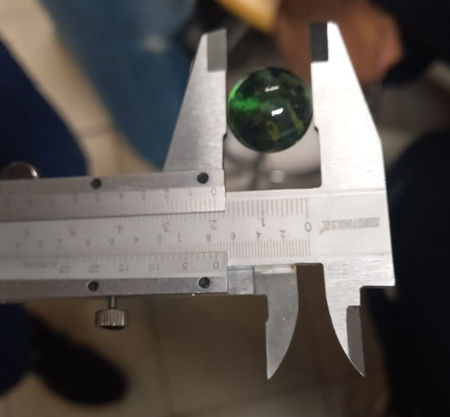
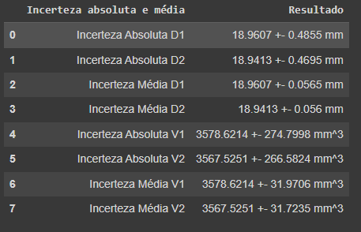

# Física Aplicada: Experimento Bolinhas de Gude

## Índice
- [Nomes](#nomes)
- [Objetivo](#objetivo)
- [Dataframe de Dados](#dataframe-de-dados)
- [Dataframe de Resultados](#dataframe-de-resultados)
- [Artigo](#artigo)
- [Como Usar](#como-usar)
- [Dependências](#dependencias)

## Nomes
* Alice Vitória Boschetti
* Eduardo Marques dos Santos
* Felipe Cordeiro Carvalho
* Gabriel Frigo Sena Silva
* Joyce Nunes Alves
* Kimberly Oliveira Germano Ribeiro

## Objetivo
* Este projeto tem como objetivo a medição de 100 bolinhas de gude com paquímetro e seu tratamento de dados a fim de obter análise de gráficos para a distribuição de medidas e cálculo de incertezas.
  


## Dataframe de Dados  

| Nome da Variável            | Descrição                                                       |
|-----------------------------|-----------------------------------------------------------------|
| D1                   | Diâmetro respectivo ao lado 1 da bolinha. |
| D2                | Diâmetro respectivo ao lado 2 da bolinha. |
| diferenca_D1_D2                        | Diferença entre medidas (d = D2-D1). |
| desvio_absoluto_D1                | Cálculo desvio absoluto para diâmetro 1. |
| desvio_absoluto_D2                         | Cálculo desvio absoluto para diâmetro 2. |
| volume_V1                         | Volume da bolinha utilizando o raio do diâmetro 1. |
| volume_V2                         | Volume da bolinha utilizando o raio do diâmetro 2. |
| diferença_V1_V2                         |  Diferença entre volumes (V = V2-V1). |
| desvio_absoluto_V1                         | Cálculo desvio absoluto para diâmetro 1. |
| desvio_absoluto_V2                         | Cálculo desvio absoluto para diâmetro 2. |


## Dataframe de Resultados

| Nome da Variável            | Descrição                                                       |
|-----------------------------|-----------------------------------------------------------------|
| Incerteza Absoluta D1	                   | Valor médio de D1 e desvio absoluto de D1 |
| Incerteza Absoluta D2	                | Valor médio de D2 e desvio absoluto de D2. |
| Incerteza Média D1	                        | Valor médio de D1 e desvio médio de D1. |
| Incerteza Média D2	                | Valor médio de D2 e desvio médio de D2. |
| Incerteza Absoluta V1                         |  Valor médio de V1 e desvio absoluto de V1. |
| Incerteza Absoluta V2                         | Valor médio de V2 e desvio absoluto de V2. |
| Incerteza Média V1	                         | Valor médio de D1 e desvio médio de D1. |
| Incerteza Média V2	                         |   Valor médio de D2 e desvio médio de D2. |




## Como Usar


## Dependências
Copie e instale as dependências abaixo:

```bash
pip install pandas
```
```bash
pip install numpy
```
```bash
pip install plotly-express
```
